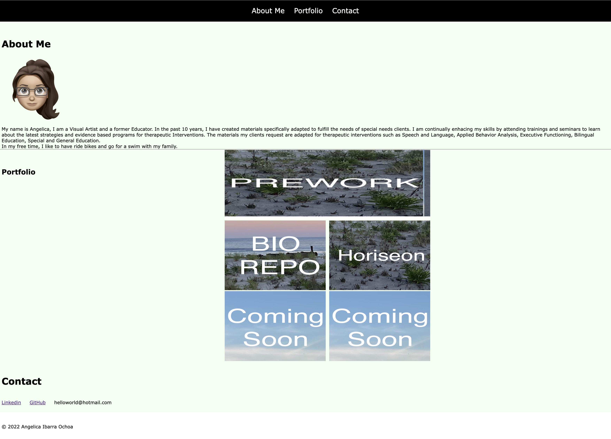

# <Portfolio>

## Description

As a developer I want to create a website to showcase my portfolio with work samples for potential employers. I want to showcase work so they can assess if I am a good candidate for an open position.This project also helps me improve my coding skills by practicing new concepts I have learned.

## Acceptance Criteria
GIVEN I wanto to give a  sample of  previous work
WHEN they load portfolio,
THEN I show my name,  avatar, and links to sections about me, my work, and how to contact me.
WHEN user clicks one of the links in the navigation,
THEN the UI scrolls to the corresponding section.
WHEN user clicks on the link to the section about my work,
THEN the UI scrolls to a section with titled images of my applications.
WHEN the first application is presented,
THEN that application's image should be larger thant the others in size.
WHEN user clicks on the images of the applications,
THEN user is taken to that deployed application.
WHEN user resizes the page or view the site on various screens and devices,
THEN user is presented with a responsive layout that adapts to their viewport.

## Table of Contents 

- [About](#About)
- [Portfolio](#Portfolio)
- [Contact](#Contact)

## Usage

The top navigation is linked to different setion of the website, each section provides the described information in the menu. The buttons in Portfolio liks to the proper applications.

## Mock Up

The project is intended to look like the example below

    

## Finished product

Here is the link of the finished work

[Deployed website](https://4ng3lic4.github.io/Portfolio/)
    

## Credits

Angelica Ibarra Ochoa

## License

MIT License

Copyright (c) 2022 Angelica

Permission is hereby granted, free of charge, to any person obtaining a copy
of this software and associated documentation files (the "Software"), to deal
in the Software without restriction, including without limitation the rights
to use, copy, modify, merge, publish, distribute, sublicense, and/or sell
copies of the Software, and to permit persons to whom the Software is
furnished to do so, subject to the following conditions:

The above copyright notice and this permission notice shall be included in all
copies or substantial portions of the Software.

THE SOFTWARE IS PROVIDED "AS IS", WITHOUT WARRANTY OF ANY KIND, EXPRESS OR
IMPLIED, INCLUDING BUT NOT LIMITED TO THE WARRANTIES OF MERCHANTABILITY,
FITNESS FOR A PARTICULAR PURPOSE AND NONINFRINGEMENT. IN NO EVENT SHALL THE
AUTHORS OR COPYRIGHT HOLDERS BE LIABLE FOR ANY CLAIM, DAMAGES OR OTHER
LIABILITY, WHETHER IN AN ACTION OF CONTRACT, TORT OR OTHERWISE, ARISING FROM,
OUT OF OR IN CONNECTION WITH THE SOFTWARE OR THE USE OR OTHER DEALINGS IN THE
SOFTWARE.

